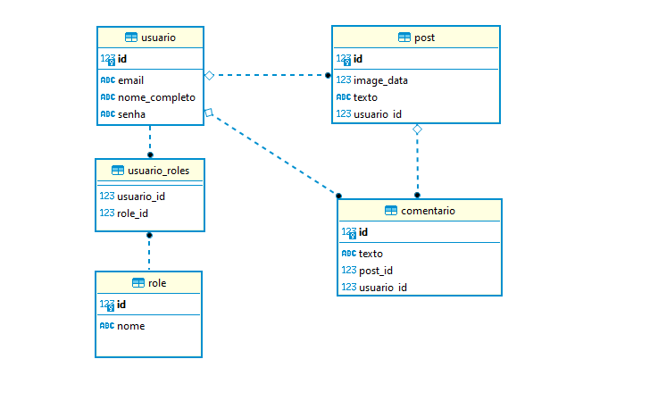

# Desafio Blog - Java


## Pré-requisitos

* Java 17
* Maven
* PostgreSQL

## Diagrama de Entidade e Relacionamento



## Variáveis de Ambiente

Para rodar essa aplicação, você vai precisar definir os valores das seguintes variáveis de ambiente no local de execução do projeto. 

| *APPLICATION*  |  *DESCRIÇÃO* |
|---|---|
| `DB_HOST`  | Define o host na URL de conexão do banco de dados.|
| `DB_NAME`  | Define o nome do database a ser acessado na URL de conexão do banco de dados. |
|  `DB_USER` | Define o nome do usuário que irá fazer acesso ao banco de dados.  |  
| `DB_PASSWORD`  | Define a senha deste usuário. |

#### - Os valores *default* para as variáveis `db_host` e `db_name`, são `localhost` e `blog-db`, respectivamente.

## Como subir o projeto

#### - Clone o projeto com o Git e navegue até o diretório do mesmo.

#### - Configure e execute o PostgreSQL.

#### - Faça o build da aplicação com o *Maven*:

```bash
  mvn clean install
```

#### - Em seguida, execute o artefato da aplicação com o seguinte comando:

```bash
  java -DDB_HOST=localhost -DDB_NAME=nome_do_banco -DDB_USER=user_db -DDB_PASSWORD=pwd_db -jar target/blog-2024.02.28.a.jar
```
    
## Documentação da API

`http://localhost:8080/swagger-ui/index.html`